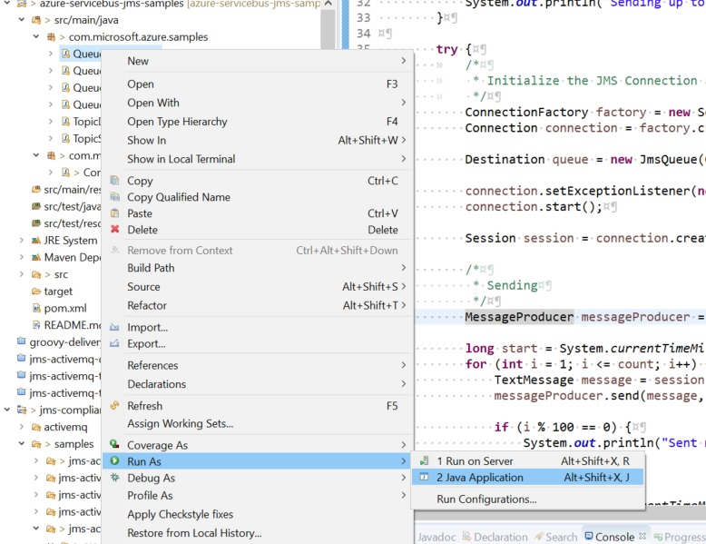

# README

This repository holds the samples for JMS 2.0 implementation for Azure Service Bus - Premium tier

## Before you begin

   * Download the Java IDE of choice - [Eclipse](https://www.eclipse.org/ide/) or [IntelliJ](https://www.jetbrains.com/idea/).
   * Clone the repository - This repository contains a Maven project that can be easily imported into the IDE. Follow this [guide](https://www.omnijava.com/2016/07/10/importing-maven-projects-from-git-into-eclipse-that-were-created-by-netbeans/) for quick steps.
   * Add Configuration - Add Service Bus Connection string to the Constants.java class.
   
		public static final String SERVICE_BUS_CONNECTION_STRING = "<YOUR_SERVICEBUS_CONNECTION_STRING>";
   
   * Select each individual sample, and run as a Java Application.
   
   	

## Samples

Below is a quick summary of which samples included and what they are currently testing.

### Queue - Send and Receive

   * Queue is created (if it doesn't exist).
   * 10 messages are sent.
   * 10 messages are received.
   
### Queue - Send and Receive messages upto 10 MB

   * Queue is created (if it doesn't exist).
   * 10 messages of 10 MB each are sent.
   * 10 messages of 10 MB each are received.

### Queue - Send and Receive messages with message selectors

   * Queue is created (if it doesn't exist).
   * 10 messages are sent - each with a custom property and a JMSCorrelation ID set.
   * A consumer is created with a message selector (JMSCorrelationID='5' AND prop1='test' OR prop2='test')
   * 1 message (which satisfies the selector conditions) is received.
   * The remaining 9 messages can be browsed using the [Service Bus Explorer](https://docs.microsoft.com/azure/service-bus-messaging/explorer).

### Cross entity Transactioned Send

   * Transacted session is created
   * 2 producers are created on 2 different queues.
   * Message is sent to the 2nd producer through the first queue.
   * The scenario is validated by receiving from both queues to ensure the message lands in the same queue.
