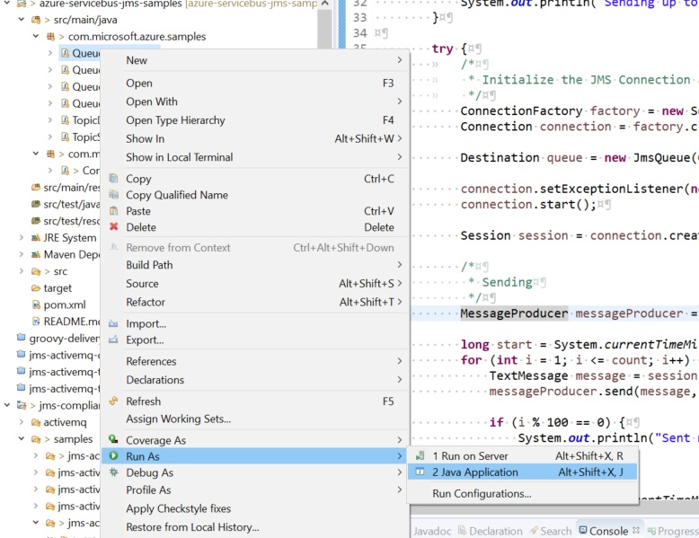

# Azure Service Bus JMS samples

Sample applications that exercise the [Azure Service Bus JMS 2.0 client](https://learn.microsoft.com/azure/service-bus-messaging/how-to-use-java-message-service-20)
against an Azure Service Bus **Premium** namespace. The samples use the Jakarta
Messaging API (`jakarta.jms`) provided by `com.azure:azure-servicebus-jms` 2.1.0
and demonstrate queues, topics, durable subscriptions, transactions, large
messages, message selectors, scheduled delivery, and resilient Spring Boot
listener configuration.

## Repository layout

* **Standalone Java samples** under [src/main/java/com/microsoft/azure/samples](src/main/java/com/microsoft/azure/samples) - small, focused `main`-method classes that each demonstrate one JMS feature. Built by the top-level `pom.xml`.
* **Spring Boot resilience sample** under [spring-boot-resilience/](spring-boot-resilience) - a standalone Spring Boot application with its own `pom.xml` that demonstrates the recommended connection factory configuration for senders and listeners. See [spring-boot-resilience/README.md](spring-boot-resilience/README.md) for build and run instructions.

The two sample sets are independent Maven projects and are built separately.

## Prerequisites

The prerequisites below apply to the standalone Java samples. The Spring Boot
resilience sample has its own prerequisites (including Java 17) - see its
[README](spring-boot-resilience/README.md).

* A [Service Bus Premium](https://learn.microsoft.com/azure/service-bus-messaging/service-bus-premium-messaging) namespace. JMS 2.0 is a Premium-only feature.
* Java 8 or later.
* [Maven](https://maven.apache.org/) (the samples are a Maven project).
* A Java IDE such as [IntelliJ IDEA](https://www.jetbrains.com/idea/) or [Eclipse](https://www.eclipse.org/ide/), or any other tool that can run a `main` method.

## Configure authentication

Open [src/main/java/com/microsoft/azure/samples/util/Constants.java](src/main/java/com/microsoft/azure/samples/util/Constants.java)
and configure **one** of the two options below. The `ConnectionHelper` prefers
Entra ID when both are set.

### Option 1 (recommended): Microsoft Entra ID

Set `SERVICE_BUS_HOST` to your namespace's fully qualified host name. The samples
authenticate via [`DefaultAzureCredential`](https://learn.microsoft.com/java/api/overview/azure/identity-readme),
which picks up your developer credentials (Azure CLI, Visual Studio, IntelliJ,
environment variables) or a managed identity when running in Azure.

```java
public static final String SERVICE_BUS_HOST = "your-namespace.servicebus.windows.net";
```

The signed-in identity needs the **Azure Service Bus Data Owner** role (or Data
Sender / Data Receiver, scoped appropriately) on the namespace.

### Option 2: connection string

Set `SERVICE_BUS_CONNECTION_STRING` to a SAS connection string from the namespace's
**Shared access policies** blade. The string must include `SharedAccessKeyName`
and `SharedAccessKey`.

```java
public static final String SERVICE_BUS_CONNECTION_STRING = "Endpoint=sb://...;SharedAccessKeyName=...;SharedAccessKey=...";
```

### Queue and topic names

The default destinations are `testqueue` and `testtopic`. Override
`Constants.QUEUE` and `Constants.TOPIC` if your namespace uses different names.
Queues and topics are created on demand by the JMS client when a producer or
consumer first uses them.

## Run a sample

Each sample is a standalone class with a `main` method. Pick one and run it from
your IDE, or from the command line:

```powershell
mvn compile exec:java -Dexec.mainClass="com.microsoft.azure.samples.QueueReceive"
```

Most samples accept an optional message count as the first program argument
(default is 10).



## Samples

| Sample | What it shows |
|--------|---------------|
| [QueueReceive](src/main/java/com/microsoft/azure/samples/QueueReceive.java) | Send and receive text messages on a queue. |
| [QueueReceive10MB](src/main/java/com/microsoft/azure/samples/QueueReceive10MB.java) | Send and receive 10 MB messages, demonstrating Premium's [large message support](https://learn.microsoft.com/azure/service-bus-messaging/service-bus-premium-messaging#large-messages-support). |
| [QueueReceiveSelector](src/main/java/com/microsoft/azure/samples/QueueReceiveSelector.java) | Filter messages on the broker side with a [JMS message selector](https://learn.microsoft.com/azure/service-bus-messaging/jms-developer-guide#jms-message-selectors). |
| [QueueScheduledSend](src/main/java/com/microsoft/azure/samples/QueueScheduledSend.java) | Send a scheduled message using JMS 2.0's `setDeliveryDelay()` API and observe the delayed arrival. |
| [QueueTransactions](src/main/java/com/microsoft/azure/samples/QueueTransactions.java) | Use a `SESSION_TRANSACTED` session to commit and roll back batches of sends. |
| [CrossEntityTransactionedSend](src/main/java/com/microsoft/azure/samples/CrossEntityTransactionedSend.java) | Send to two queues atomically through a single transacted session by using one of them as the [transaction root](https://learn.microsoft.com/azure/service-bus-messaging/service-bus-transactions#transactions-across-entities). |
| [TopicSubscribers](src/main/java/com/microsoft/azure/samples/TopicSubscribers.java) | Publish to a topic and consume with non-durable subscribers, including a selector-filtered subscriber. |
| [TopicDurableSubscribers](src/main/java/com/microsoft/azure/samples/TopicDurableSubscribers.java) | Publish to a topic and consume with durable subscribers (`createDurableSubscriber` and `createSharedDurableConsumer`). The sample unsubscribes at the end; comment out the `unsubscribe` calls to keep the subscriptions for inspection. |

## Spring Boot resilience sample

The [spring-boot-resilience](spring-boot-resilience) module is a standalone
Spring Boot application that demonstrates the recommended connection factory
configuration for Azure Service Bus JMS:

* `CachingConnectionFactory` for senders, so `JmsTemplate` reuses connections and sessions across sends.
* Raw `ServiceBusJmsConnectionFactory` for listeners, so each listener container manages its own AMQP connection and can recover independently when a connection is disrupted.

It also shows the listener container settings and `ExceptionListener` wiring
needed to surface connection failures instead of letting listeners stall
silently. See [spring-boot-resilience/README.md](spring-boot-resilience/README.md)
for the full walkthrough, including a comparison against the
`spring-cloud-azure-starter-servicebus-jms` property-based defaults.

## Inspect messages

Use [Service Bus Explorer](https://learn.microsoft.com/azure/service-bus-messaging/explorer)
in the Azure portal to peek at messages that the samples leave behind (for
example, the messages the selector sample doesn't consume).

## More information

* [Service Bus JMS 2.0 developer guide](https://learn.microsoft.com/azure/service-bus-messaging/jms-developer-guide)
* [Use Service Bus with the JMS 2.0 client](https://learn.microsoft.com/azure/service-bus-messaging/how-to-use-java-message-service-20)
* [Service Bus Premium overview](https://learn.microsoft.com/azure/service-bus-messaging/service-bus-premium-messaging)
